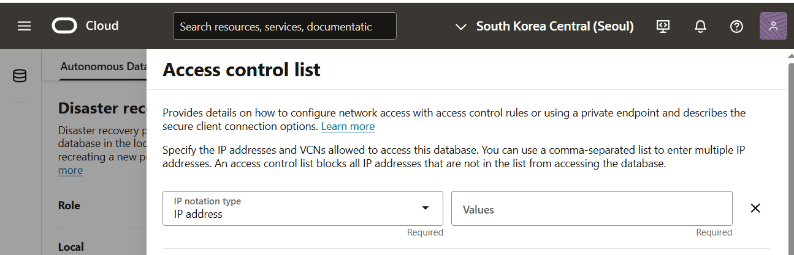
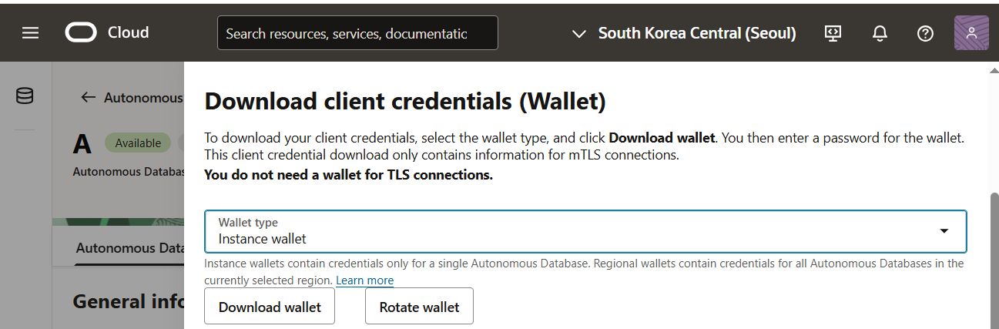

Balance-Book 프로젝트에 `루틴 점검` 메뉴를 새로 추가하기 위한 백엔드 기반을 Oracle Cloud 위에서 구성한 과정 기록입니다.

---

## 1️⃣ Oracle Cloud DB 생성 및 접속

### 🎯 목적  
- 루틴 점검 기능을 위한 테이블 설계 및 생성  

### 🧭 과정 요약

1. **OCI 계정 생성**  
   - Oracle Cloud 가입 [OCI](https://cloud.oracle.com/)

2. **Autonomous DB 인스턴스 생성**  
   - Transaction Processing

3. **DB Tool 접속 설정**
   - (Access Control List 화면) 접속 기기 IP 추가


   - (Database connection 화면) Wallet 파일 다운로드


4. **SQL Developer 연결 설정**  
   - (SQL Developer) Wallet 설정을 통해 접속
     - 접속 유형: 클라우드 전자 지갑
     - 세부 정보 > 구성 파일: 다운로드 받은 Wallet 파일

---

## 2️⃣ BALANCE_BOOK 사용자(스키마) 생성

BALANCE_BOOK 프로젝트에 사용할 Oracle 사용자(스키마)를 생성

```sql
-- 사용자 생성
CREATE USER BALANCE_BOOK IDENTIFIED BY "********************";

-- 권한 부여
GRANT CONNECT, RESOURCE TO BALANCE_BOOK;

-- 테이블 생성 가능한 공간 부여
ALTER USER BALANCE_BOOK QUOTA UNLIMITED ON DATA;
```

---

## 3️⃣ 테이블 설계 및 생성

### 🎯 목적  
- 평일/휴일 루틴 템플릿, 항목, 점검 기록을 관계형 구조로 저장  
- 항목별 체크 상태를 기록해 캘린더 UI와 연동 가능하도록 준비

---

### ✅ 테이블 목록

| 테이블명                    | 설명                       |
| --------------------------- | -------------------------- |
| `TBL_ROUTINE_TEMPLATE`      | 루틴 템플릿 (평일/휴일 등) |
| `TBL_ROUTINE_TEMPLATE_ITEM` | 루틴 항목 목록             |
| `TBL_ROUTINE_CHECK`         | 날짜별 루틴 수행 회차      |
| `TBL_ROUTINE_CHECK_ITEM`    | 항목별 체크 상세 항목      |

---

### 🧱 핵심 테이블 생성 SQL

#### 🔹 루틴 템플릿

```sql
CREATE TABLE TBL_ROUTINE_TEMPLATE (
    ID            VARCHAR2(10)    PRIMARY KEY,      -- 예: RT-0001
    TITLE         VARCHAR2(100),
    TYPE          VARCHAR2(20),                     -- WEEKDAY / HOLIDAY
    IS_USABLE     CHAR(1),                          -- 'T' / 'F'
    REMARK        VARCHAR2(200),
    CREATED_AT    TIMESTAMP DEFAULT CURRENT_TIMESTAMP,
    CREATED_BY    VARCHAR2(36),
    UPDATED_AT    TIMESTAMP,
    UPDATED_BY    VARCHAR2(36)
);
```

#### 🔹 루틴 항목

```sql
CREATE TABLE TBL_ROUTINE_TEMPLATE_ITEM (
    ID            VARCHAR2(20) PRIMARY KEY,         -- 예: RTI-0001-0001
    TEMPLATE_ID   VARCHAR2(10) NOT NULL,
    TITLE         VARCHAR2(100),
    ORDER_NO      NUMBER,
    IS_USABLE     CHAR(1),
    REMARK        VARCHAR2(200),
    CREATED_AT    TIMESTAMP DEFAULT CURRENT_TIMESTAMP,
    CREATED_BY    VARCHAR2(36),
    UPDATED_AT    TIMESTAMP,
    UPDATED_BY    VARCHAR2(36)
);
```

#### 🔹 루틴 체크 회차

```sql
CREATE TABLE TBL_ROUTINE_CHECK (
    ID              NUMBER PRIMARY KEY,
    CHECK_TIME      TIMESTAMP NOT NULL,
    TEMPLATE_ID     VARCHAR2(10),
    TEMPLATE_TYPE   VARCHAR2(20),
    STATUS          VARCHAR2(20),       -- 예: PROG, COMP
    REMARK          VARCHAR2(200),
    CREATED_AT      TIMESTAMP DEFAULT CURRENT_TIMESTAMP,
    CREATED_BY      VARCHAR2(36),
    UPDATED_AT      TIMESTAMP,
    UPDATED_BY      VARCHAR2(36)
);
```

#### 🔹 루틴 항목 체크 상세 항목

```sql
CREATE TABLE TBL_ROUTINE_CHECK_ITEM (
    ID              NUMBER PRIMARY KEY,
    CHECK_ID        NUMBER,
    ITEM_ID         VARCHAR2(20),
    IS_CHECKED      CHAR(1),            -- 'T' / 'F'
    CHECK_TIME      TIMESTAMP,
    REMARK          VARCHAR2(200),
    CREATED_AT      TIMESTAMP DEFAULT CURRENT_TIMESTAMP,
    CREATED_BY      VARCHAR2(36),
    UPDATED_AT      TIMESTAMP,
    UPDATED_BY      VARCHAR2(36)
);
```

## ✅ 루틴 기능 개발 TODO

---

### 🗄️ DB (Oracle)

- 루틴 체크 및 항목 ID용 시퀀스 생성
- 평일/휴일 템플릿 및 항목 샘플 데이터 입력
- 날짜별 루틴 상태 계산용 SQL 뷰 생성

---

### 🧠 백엔드 (C# .NET)

- Oracle 연결 설정 (`BALANCE_BOOK` 사용자)
- 루틴 관련 API 구현  
  (`/routine/template`, `/routine/check`, `/routine/calendar-status`)
- 루틴 상태 계산 로직 및 항목 체크 처리

---

### 🎨 프론트엔드 (React)

- 달력 UI 구성 및 루틴 상태 색상 표시
- 날짜 클릭 → 루틴 항목 체크 화면 이동
- 항목별 체크 상태 변경 UI 및 API 연동