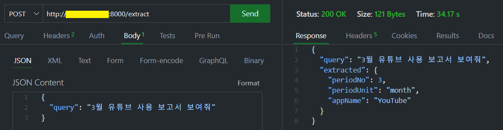

## ⚙️ 개요

**1. LLM 기반 파라미터 추출 기능 적용을 위한 VM 생성 및 구성** 
**2. Ollama + FastAPI로 추출기 서버 구성 및 테스트**

---

## 🖥️ 1. VM 생성 및 기본 세팅 (Azure)

- **머신 타입**: 처음엔 B1ms (실패), 후에 B2ms(2vCPU / 8GB RAM)으로 업그레이드
- **OS**: Ubuntu 22.04 LTS
- **인증 방식**: SSH 키
- **인바운드 포트**:
  - SSH (22)
  - FastAPI (8000)
  - Ollama API (11434)

---

## 🤖 2. Ollama 설치 및 테스트

```bash
curl -fsSL https://ollama.com/install.sh | sh
ollama pull phi3:mini
ollama run phi3:mini
```

- VM의 메모리가 2GB일 경우 실행 불가 (`requires 5.6GiB`)
- VM 크기를 B2ms로 올려서 정상 작동 확인
- `localhost:11434`에서 API 호출 가능

---

## 🐍 3. FastAPI + LLM 파라미터 추출기 서버 구성

```bash
sudo apt install python3-venv -y
python3 -m venv ocrenv
source ocrenv/bin/activate
pip install fastapi uvicorn requests
```

- 자연어 문장을 POST하면 LLM이 아래 JSON 형태로 파라미터 추출:

```json
{
  "periodNo": 6,
  "periodUnit": "month",
  "appName": "YouTube"
}
```

- 예시 문장:
  `"6월 유튜브 사용 보고서 보여줘"`

---

## 🧠 4. Prompt 설계

```text
다음 문장에서 기간(periodNo), 단위(periodUnit), 앱 이름(appName)을 추출해서
아래처럼 JSON으로 출력해줘. 설명 없이 JSON만 출력해.

예시:
입력: "6월 넷플릭스 사용 기록 알려줘"
응답:
{ "periodNo": 6, "periodUnit": "month", "appName": "Netflix" }

입력: "6월 유튜브 사용 보고서 보여줘"
응답:
```

- 위와 같이 **예시 기반(Few-shot)** Prompt 구성으로 정확도 향상됨

---

## 🚀 5. 파라미터 추출 테스트

- `Visual Studio Code Extension Thunder Client`로 테스트

 - [요청 메시지]
```json
{
  "query": "3월 유튜브 사용 보고서 보여줘"
}
```

 - [응답 데이터]
```json
{
  "periodNo": 3,
  "periodUnit": "month",
  "appName": "YouTube"
}
```


---

## ✅ 향후 계획

- **Balance-Book 대출/카드 사용 리포트 기능**에 적용 
  - 추출된 JSON을 기반으로 .NET API 호출
  - 실제 리포트 데이터 반환
  - 프론트엔드와 연결
