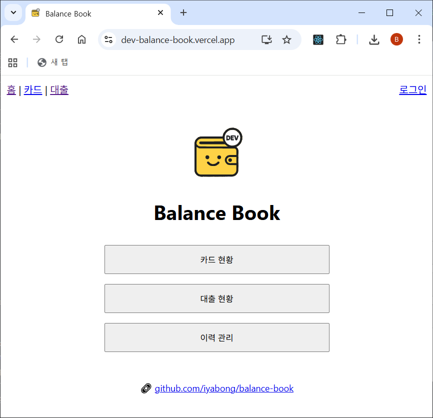
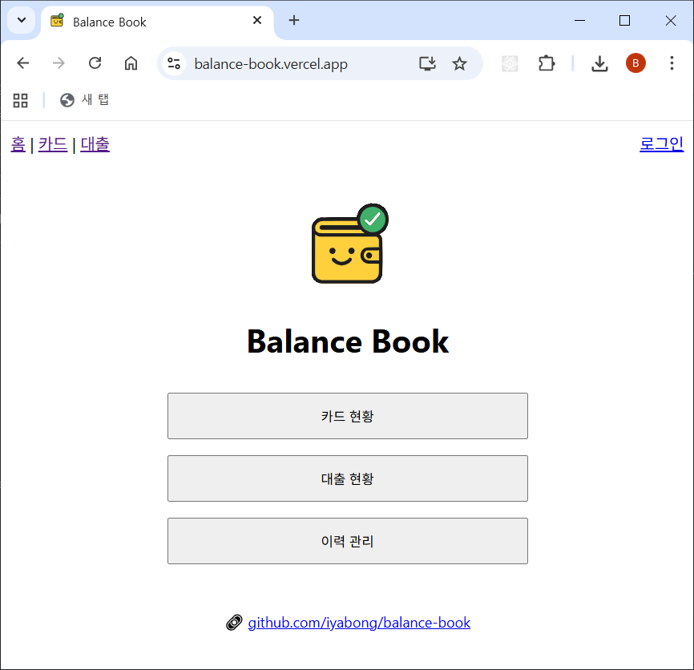

---
categories:
- Balance-Book
date: 2025-10-04
tags:
- Vercel
- NODE_ENV
- Favicon
- Logo
- React
title: Balance-Book 개발기 (14) - 환경별 로고 & Favicon 분기 처리 ✨
---

개발(`dev`/`preview`)과 운영(`prod`) 환경에 따라 **메인 로고와
favicon**을 다르게 표시하도록 개선했다.\
`NODE_ENV` + `VERCEL_ENV` 값을 함께 확인하는 방식으로 분기를 구현. 🛠️

------------------------------------------------------------------------

## 1️⃣ 환경 변수 설명

-   **NODE_ENV**
    -   React 기본 빌드 모드
    -   `development` : 로컬 개발 시
    -   `production` : Vercel 배포 시 (Preview, Production 모두 동일하게
        `production`)
-   **VERCEL_ENV**
    -   Vercel이 제공하는 배포 환경 구분 값
    -   `development` : 로컬 dev 서버 (`vercel dev`)
    -   `preview` : Git 브랜치 Preview 배포 (예: `dev`, `feature/*`)
    -   `production` : main 브랜치 → 운영 배포

👉 따라서 **정확한 분기**를 위해 `NODE_ENV`와 `VERCEL_ENV`를 동시에 확인해야 한다.

------------------------------------------------------------------------

## 2️⃣ 수정/추가한 파일

-   `frontend/src/utils/env.js`
-   `frontend/src/App.jsx`
-   `frontend/src/Home.jsx`
-   `frontend/public/wallet_dev.svg` (dev 전용 로고)
-   `frontend/public/favicon_wallet_dev.ico` (dev 전용 파비콘)

------------------------------------------------------------------------

## 3️⃣ 주요 코드

### utils/env.js

``` javascript
export const getNodeEnv = () => process.env.NODE_ENV;
export const getVercelEnv = () => process.env.VERCEL_ENV;

export function setFavicon() {
  const link = document.querySelector("link[rel='icon']") || document.createElement("link");
  link.rel = "icon";
  link.href =
    getNodeEnv() === "production" && getVercelEnv() === "production"
      ? "/favicon_wallet.ico"
      : "/favicon_wallet_dev.ico";
  document.head.appendChild(link);
}
```

------------------------------------------------------------------------

### App.jsx

``` javascript
import { useEffect } from "react";
import { setFavicon } from "./utils/env";

function App() {
  useEffect(() => {
    setFavicon(); // 앱 시작 시 환경별 favicon 자동 세팅
  }, []);

  return <div>{/* ... */}</div>;
}

export default App;
```

------------------------------------------------------------------------

### Home.jsx

``` javascript
import { getNodeEnv, getVercelEnv } from './utils/env';

const walletLogo =
  getNodeEnv() === "production" && getVercelEnv() === "production"
    ? "/wallet.svg"
    : "/wallet_dev.svg";

const Home = ({ user }) => (
  <div>
    
  </div>
);

export default Home;
```

------------------------------------------------------------------------

## 4️⃣ 적용 결과

-   **개발/프리뷰(Dev/Preview)**\
    ✅ `/wallet_dev.svg`\
    ✅ `/favicon_wallet_dev.ico`
    


-   **운영(Production)**\
    ✅ `/wallet.svg`\
    ✅ `/favicon_wallet.ico`
    

